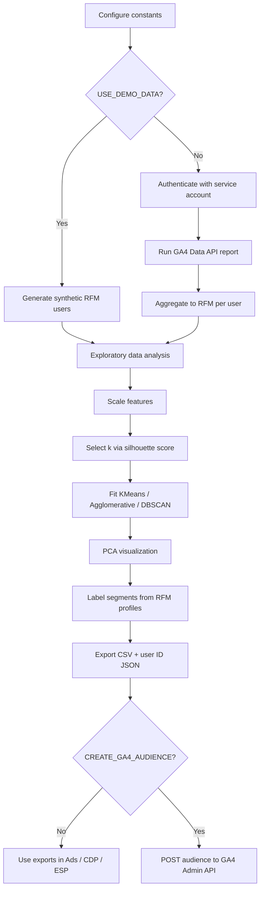
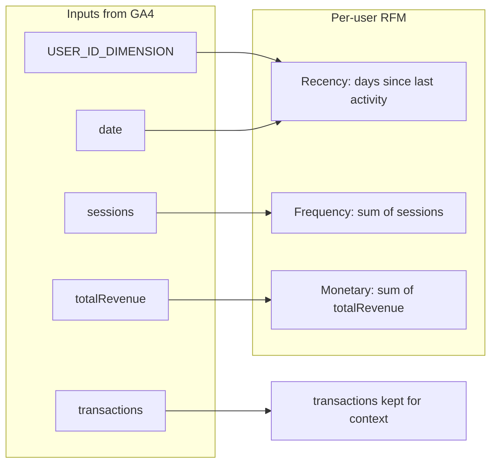

# GA4 RFM Model

Build **Recency / Frequency / Monetary (RFM)** customer segments from [Google Analytics 4](https://developers.google.com/analytics), cluster users with unsupervised learning, label segments from their RFM profiles, and export audiences for activation.

This repository is a cleaned, public-ready example. All property IDs, credentials, and real user data are placeholders or synthetic.

---

## What you get

| Asset | Purpose |
|-------|---------|
| [`RFM_GA4_Audience_Creation.ipynb`](RFM_GA4_Audience_Creation.ipynb) | End-to-end notebook: config → GA4/demo data → EDA → clustering → segment export |
| [`requirements.txt`](requirements.txt) | Python dependencies |
| [`.gitignore`](.gitignore) | Blocks credentials, CSVs, and local outputs from git |

**Default mode is demo data** (`USE_DEMO_DATA = True`), so anyone can clone and run the notebook without GA4 access.

---

## Workflow



### RFM definitions


---

## Quick start (demo mode)

```bash
git clone https://github.com/ivanpfaab/ga4-rfm-model.git
cd ga4-rfm-model

python3 -m venv .venv
source .venv/bin/activate   # Windows: .venv\Scripts\activate
pip install -r requirements.txt

jupyter notebook RFM_GA4_Audience_Creation.ipynb
# or: jupyter lab / VS Code / Cursor notebook UI
```

1. Open the notebook.
2. Leave `USE_DEMO_DATA = True` in the **Configuration** cell.
3. Run all cells.
4. Inspect plots and files under `output/` (gitignored).

---

## Use your own GA4 property

### 1. GCP & GA4 setup

1. In Google Cloud, enable:
   - **Google Analytics Data API** (required for reports)
   - **Google Analytics Admin API** (only if you will create audiences)
2. Create a **service account** and download a JSON key.
3. In GA4 **Admin → Property access management**, add the service account email:
   - **Viewer** (or Analyst) to read reports
   - **Editor** if `CREATE_GA4_AUDIENCE = True`
4. Place the JSON key at the path in `SERVICE_ACCOUNT_PATH` (default: `./service_account.json`).  
   **Never commit this file** — it is covered by `.gitignore`.

### 2. Edit the Configuration cell

All environment-specific values live in one cell at the top of the notebook:

| Constant | Example | Meaning |
|----------|---------|---------|
| `GA4_PROPERTY_ID` | `"123456789"` | Numeric property ID (Admin → Property settings) |
| `SERVICE_ACCOUNT_PATH` | `Path("service_account.json")` | Local path to the JSON key |
| `START_DATE` / `END_DATE` | `"90daysAgo"` / `"yesterday"` | Report window |
| `USER_ID_DIMENSION` | `"customUser:custom_client_id"` | Must match your GA4 custom dimension API name, or use `"userId"` |
| `USE_DEMO_DATA` | `False` | Switch to live GA4 |
| `N_CLUSTERS_MIN` / `MAX` | `3` / `8` | Silhouette search range for KMeans |
| `PRIMARY_CLUSTER_METHOD` | `"kmeans"` | Method used for naming & audience export |
| `TARGET_SEGMENT_NAME` | `"Champions"` | Segment to export / optionally create |
| `CREATE_GA4_AUDIENCE` | `False` | Opt-in Admin API write |

### 3. Identity dimension tips

RFM needs a stable user key:

- Prefer GA4 **User-ID** (`userId`) if you set it on the site/app.
- Or a **user-scoped custom dimension** (e.g. CRM ID / client ID). The API name looks like `customUser:<parameter_name>`.
- Rows with `(not set)` are dropped automatically.

### 4. Run live

1. Set `USE_DEMO_DATA = False` and fill `GA4_PROPERTY_ID`.
2. Confirm `SERVICE_ACCOUNT_PATH` points at your key.
3. Run all cells.
4. Outputs:
   - `output/rfm_dataset.csv` — per-user RFM
   - `output/rfm_segments.csv` — RFM + cluster labels
   - `output/audience_<segment>_user_ids.json` — IDs for the target segment

---

## Method notes

### Why silhouette score?

The original notebook fixed `k=9`. This version searches `N_CLUSTERS_MIN`…`N_CLUSTERS_MAX` and picks the **highest silhouette score** so segment count fits your data.

### Why profile-based labels?

Hard-coding “cluster 0 = Champions” is wrong when algorithms reshuffle IDs. Labels are assigned from each cluster’s **mean recency / frequency / monetary** (low/mid/high tertiles), then matched to names such as Champions, At Risk, Hibernating.

### Audience creation

- Default: **no API writes**. You get CSV/JSON for Ads Customer Match, ESP sync, or the GA4 UI.
- Optional: set `CREATE_GA4_AUDIENCE = True` (live mode only) to POST an Admin API audience template.
- Large segments: prefer the exported ID list over embedding thousands of values in an `IN_LIST` filter (size limits apply; template caps at 500 IDs).

---

## Project layout

```text
ga4-rfm-model/
├── README.md
├── requirements.txt
├── .gitignore
├── RFM_GA4_Audience_Creation.ipynb
├── service_account.json          # you add locally — not in git
└── output/                       # generated — not in git
    ├── rfm_dataset.csv
    ├── rfm_segments.csv
    └── audience_*_user_ids.json
```

---

## Requirements

- Python 3.10+
- Jupyter / VS Code / Cursor (or any ipykernel host)
- For live mode: GA4 property with purchase/revenue events and a usable user identifier

---

## License / usage

Example project for learning and adapting RFM segmentation on GA4. Point the constants at your own property; do not commit production credentials or user-level exports.
